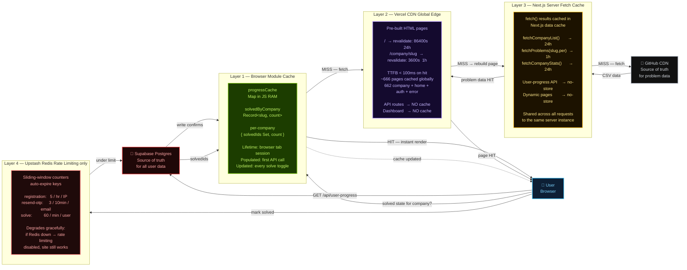
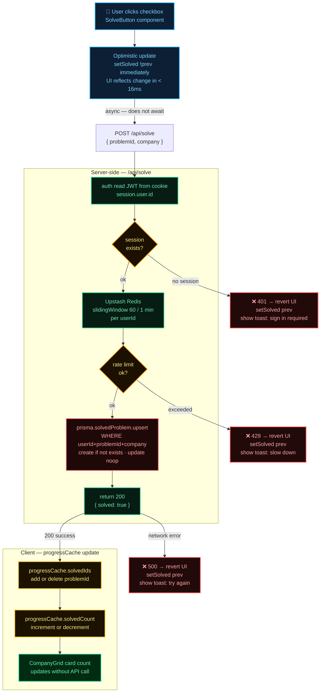
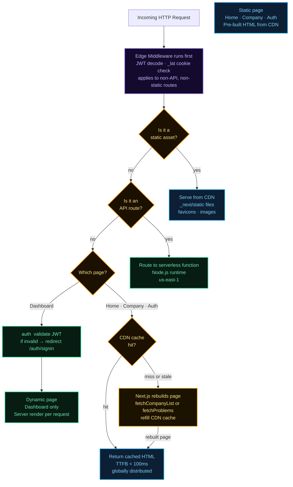
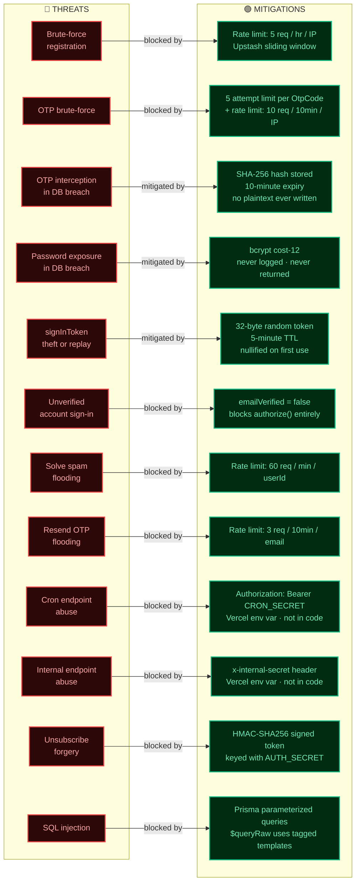

# System Architecture Diagrams — Code Company Wise

> **How to view:** VS Code → Open Preview (⇧⌘V). Mermaid renders natively since VS Code 1.80.  
> If diagrams don't show, install the **"Markdown Preview Mermaid Support"** extension.

---

## 1 · Master Architecture — The Full Whiteboard

> *This is the one diagram you draw first. Every box is a component, every arrow is a design decision you must be able to defend.*

```mermaid
flowchart TD
    %% ── Colour palette by layer ──────────────────────────────────────────
    classDef clientCls  fill:#0d1f35,stroke:#38bdf8,stroke-width:2px,color:#7dd3fc
    classDef cacheCls   fill:#1c1200,stroke:#fbbf24,stroke-width:2px,color:#fde68a
    classDef edgeCls    fill:#140a2e,stroke:#a78bfa,stroke-width:2px,color:#c4b5fd
    classDef fnCls      fill:#071c12,stroke:#34d399,stroke-width:2px,color:#6ee7b7
    classDef dbCls      fill:#1f0808,stroke:#f87171,stroke-width:2px,color:#fca5a5
    classDef extCls     fill:#111111,stroke:#9ca3af,stroke-width:2px,color:#d1d5db
    classDef cronCls    fill:#0a0a20,stroke:#818cf8,stroke-width:2px,color:#a5b4fc

    %% ── CLIENT BROWSER ───────────────────────────────────────────────────
    subgraph BROWSER ["🌐  CLIENT BROWSER"]
        direction TB
        HP["🏠 Home  SSG ○\n662 company cards\n24h CDN cache"]
        CP["🏢 Company  ISR ●\n662 pages · 1 page per company\n5 periods bundled as props\n1h revalidation"]
        AP["🔐 Auth Pages  SSG ○\nsignin · signup · verify"]
        DP["📊 Dashboard  Dynamic ƒ\nper-user · force-dynamic"]
        CG["CompanyGrid\nIntersectionObserver\n50 cards / batch"]
        CPC["CompanyProgress\nuseCompanyProgress hook\nProgressBar + ProblemTable"]
        SBN["SolveButton\nhandleSolveToggle\noptimistic update · revert on failure"]
        PC["💾 progressCache\nmodule-level Map in RAM\nzero-flash across navigations"]
    end

    %% ── VERCEL EDGE ──────────────────────────────────────────────────────
    subgraph VEDGE ["⚡  VERCEL EDGE NETWORK"]
        CDN["🌍 Global CDN\n~666 pages pre-built\nTTFB < 100ms on cache hit"]
        MW["🔀 Edge Middleware\nJWT decode — zero DB calls\n_lat cookie dedup\nfire-and-forget activity ping"]
    end

    %% ── NEXT.JS SERVERLESS ───────────────────────────────────────────────
    subgraph FNLAYER ["☁️  SERVERLESS FUNCTIONS  (Node.js · us-east-1)"]
        NA["🔑 NextAuth v5\nCredentials Provider\nJWT → httpOnly cookie"]
        REG["POST /api/auth/register\n① upsert User  emailVerified=false\n② SHA-256 OTP → OtpCode\n③ Gmail OTP email\n④ rate-limit: 5 / hr / IP"]
        VER["POST /api/auth/verify-otp\n① compare SHA-256 hash\n② attempts ≤ 5 guard\n③ emailVerified = true\n④ signInToken 32B · 5min TTL"]
        RES["POST /api/auth/resend-otp\n① user must be unverified\n② delete old OtpCode\n③ new OTP + Gmail\n④ rate-limit: 3 / 10min / email"]
        SOL["POST /api/solve\n① auth check\n② rate-limit: 60 / min / user\n③ upsert SolvedProblem"]
        PRG["GET /api/user-progress\n?company=slug  or  all\n→ {solvedIds, count}"]
        TRK["POST /api/internal/track-active\nx-internal-secret header guard\nlastActiveAt = NOW()"]
        UNS["GET /api/unsubscribe\nHMAC-SHA256 token verify\nemailOptOut = true\nredirect /?unsubscribe=success"]
        CRN["GET /api/cron/reengagement\nBearer CRON_SECRET guard\n$queryRaw inactive ≥ 7d\nLIMIT 100 / run"]
    end

    %% ── VERCEL CRON ──────────────────────────────────────────────────────
    subgraph VCRON ["⏰  VERCEL CRON"]
        SCH["cron: 0 9 ✱ ✱ ✱  UTC\ndaily trigger at 09:00"]
    end

    %% ── DATA STORES ──────────────────────────────────────────────────────
    subgraph DSTORE ["🗄️  DATA STORES"]
        direction LR
        PG["🐘 Supabase Postgres\n─────────────────────\nUser\nOtpCode\nSolvedProblem"]
        RD["⚡ Upstash Redis\n─────────────────────\nSliding-window\nrate counters · auto-expire"]
    end

    %% ── EXTERNAL SERVICES ────────────────────────────────────────────────
    subgraph EXTSVC ["🌍  EXTERNAL SERVICES"]
        direction LR
        GH["📄 GitHub Raw CDN\n662 company CSVs\n~3,000 problems\nfetch() + 1h Next.js cache"]
        GM["📧 Gmail SMTP\nNodemailer transporter\nOTP + re-engagement emails"]
    end

    %% ── CONNECTIONS ──────────────────────────────────────────────────────

    BROWSER    -->|"HTTPS"| CDN
    CDN        -->|"cache HIT — HTML < 100ms"| BROWSER
    CDN        -->|"cache MISS → rebuild"| FNLAYER
    FNLAYER    -->|"fetch CSVs · 1h cache"| GH

    MW         -.->|"fire-and-forget\nnon-blocking POST"| TRK

    SBN        -->|"POST /api/solve"| SOL
    CG & CPC   -->|"GET /api/user-progress"| PRG
    AP         -->|"signIn credentials"| NA

    PRG        -.->|"populate on first call"| PC
    PC         -.->|"instant read · no API call"| SBN & CPC & CG

    REG        -->|"success → redirect to verify"| VER
    VER        -->|"signIn with signInToken"| NA

    NA         --> PG
    REG        --> PG
    VER        --> PG
    RES        --> PG
    SOL        -->|"upsert SolvedProblem"| PG
    PRG        --> PG
    TRK        -->|"update lastActiveAt"| PG
    UNS        -->|"emailOptOut = true"| PG
    CRN        -->|"$queryRaw + update reengageSentAt"| PG

    REG        -->|"rate limit"| RD
    RES        -->|"rate limit"| RD
    SOL        -->|"rate limit"| RD

    REG & RES  -->|"OTP email"| GM
    CRN        -->|"re-engagement email"| GM

    SCH        -->|"GET + Bearer token"| CRN

    %% ── Apply colours ────────────────────────────────────────────────────
    class HP,CP,AP,DP,CG,CPC,SBN clientCls
    class PC,RD cacheCls
    class CDN,MW edgeCls
    class NA,REG,VER,RES,SOL,PRG,TRK,UNS,CRN fnCls
    class PG dbCls
    class GH,GM extCls
    class SCH cronCls
```



---

## 2 · Authentication Flow (Deep Dive)

> *Two paths share one NextAuth Credentials provider. Interview question: "Why not OAuth?" — this system needs email ownership proof for a free tool with no social login requirement.*

```mermaid
flowchart TD
    classDef clientCls  fill:#0d1f35,stroke:#38bdf8,stroke-width:2px,color:#7dd3fc
    classDef fnCls      fill:#071c12,stroke:#34d399,stroke-width:2px,color:#6ee7b7
    classDef dbCls      fill:#1f0808,stroke:#f87171,stroke-width:2px,color:#fca5a5
    classDef extCls     fill:#111111,stroke:#9ca3af,stroke-width:2px,color:#d1d5db
    classDef decCls     fill:#1c1000,stroke:#f59e0b,stroke-width:2px,color:#fde68a
    classDef okCls      fill:#022c12,stroke:#10b981,stroke-width:2px,color:#6ee7b7
    classDef failCls    fill:#220a0a,stroke:#ef4444,stroke-width:2px,color:#fca5a5

    %% ── PATH A: REGISTRATION ─────────────────────────────────────────────
    subgraph PATHA ["PATH A — New User Registration"]
        A1["User submits SignUp form\nemail · password · name"]
        A2["POST /api/auth/register\nnormalize email lowercase+trim"]
        A3{"IP rate limit\n5 req / hr ?"}
        A4["upsert User\nemailVerified = false\nbcrypt hash password cost 12"]
        A5["deleteMany old OtpCodes\ncreate OtpCode\ncodeHash = SHA-256 code\nexpiresAt = now + 10 min\nattempts = 0"]
        A6["Gmail SMTP\nsend 6-digit OTP email"]
        A7["Redirect → /auth/verify\nURL: ?email=..."]
        A8["User reads email\nenters OTP in form"]
        A9["POST /api/auth/verify-otp\nfind OtpCode WHERE email=..."]
        A10{"OTP expired?\nattempts > 5?"}
        A11{"SHA-256 input\n=== codeHash ?"}
        A12["DELETE OtpCode record\nUser.emailVerified = true\nUser.signInToken = randomBytes 32\nUser.signInTokenExpiry = +5 min"]
        A13["Client calls signIn\ncredentials\n{ email, signInToken }"]
    end

    %% ── PATH B: SIGN IN ──────────────────────────────────────────────────
    subgraph PATHB ["PATH B — Returning User Sign In"]
        B1["User submits SignIn form\nemail · password"]
        B2["Client calls signIn\ncredentials\n{ email, password }"]
    end

    %% ── NEXTAUTH AUTHORIZE ───────────────────────────────────────────────
    subgraph AUTHZ ["NextAuth authorize  shared by both paths"]
        C1["prisma.user.findUnique\nWHERE email = input"]
        C2{"user exists?\nemailVerified = true?"}
        C3{"password path:\nbcrypt.compare hash\n\ntoken path:\nsignInToken match?\nnot expired?"}
        C4["consume signInToken\nset null in DB\none-time use enforced"]
        C5["return { id, email, name }\n→ NextAuth builds JWT payload"]
        C6["JWT signed with AUTH_SECRET\nstored in httpOnly cookie\nsession active ✓"]
    end

    %% ── ERROR STATES ─────────────────────────────────────────────────────
    E1["❌ 429 Too Many Requests"]
    E2["❌ 400 OTP Expired\nor Max Attempts Reached"]
    E3["❌ 401 Invalid OTP"]
    E4["❌ 401 Unauthorized\nno user · unverified · bad creds"]

    %% ── FLOW ─────────────────────────────────────────────────────────────
    A1 --> A2 --> A3
    A3 -->|"exceeded"| E1
    A3 -->|"ok"| A4
    A4 --> A5 --> A6 --> A7 --> A8 --> A9 --> A10
    A10 -->|"yes"| E2
    A10 -->|"no"| A11
    A11 -->|"no match"| E3
    A11 -->|"match ✓"| A12 --> A13 --> C1

    B1 --> B2 --> C1

    C1 --> C2
    C2 -->|"no"| E4
    C2 -->|"yes"| C3
    C3 -->|"fail"| E4
    C3 -->|"signInToken path"| C4 --> C5
    C3 -->|"password path"| C5
    C5 --> C6

    class A1,A7,A8,B1 clientCls
    class A2,A4,A5,A6,A9,A12,A13,B2,C1,C4,C5 fnCls
    class C2,C3,A3,A10,A11 decCls
    class C6 okCls
    class E1,E2,E3,E4 failCls
```



---

## 3 · Re-engagement Email Pipeline

> *Interview question: "How do you avoid hammering users with emails?" — three guards: emailOptOut flag, reengageSentAt < lastActiveAt condition, and LIMIT 100 per cron run.*


---

## 4 · Caching Strategy — 4 Layers

> *Interview question: "What happens if GitHub goes down?" — Layer 3 serves stale cache, users see old (but valid) data. Static pages still work. Only live API calls break.*



---

## 5 · Database Schema (Entity–Relationship)

> *Interview question: "Why store company in SolvedProblem?" — a user can solve the same problem in different company contexts; (userId, problemId, company) is the true unique key.*

```mermaid
erDiagram
    User {
        String  id              PK  "cuid()"
        String  email           UK  "unique · nullable for OAuth future"
        String  name                "nullable display name"
        String  password            "bcrypt cost-12 · nullable"
        Boolean emailVerified       "default false · gate for auth"
        DateTime createdAt          "default now()"
        DateTime lastActiveAt   IDX "default now() · INDEX for cron query"
        DateTime reengageSentAt     "nullable · compared vs lastActiveAt"
        Boolean emailOptOut         "default false · GDPR exit"
        String  signInToken         "nullable · 32-byte random · single-use"
        DateTime signInTokenExpiry  "nullable · 5-minute TTL"
    }

    OtpCode {
        String  id        PK  "cuid()"
        String  email     IDX "not a FK — looked up by email string"
        String  codeHash      "SHA-256 hex — plaintext never stored"
        Int     attempts      "default 0 · max 5 guard"
        DateTime expiresAt    "now + 10 minutes"
        DateTime createdAt    "default now()"
    }

    SolvedProblem {
        String  id        PK  "cuid()"
        String  userId    FK  "cascade delete"
        Int     problemId     "LeetCode problem number"
        String  company       "company slug e.g. google"
        DateTime solvedAt     "default now()"
    }

    User         ||--o{ SolvedProblem : "has solved"
    User         ||--o{ OtpCode       : "requests OTP via email match"
```

**Index summary:**

| Table | Index | Type | Purpose |
|---|---|---|---|
| User | `email` | UNIQUE | fast lookup on sign-in |
| User | `lastActiveAt` | B-Tree | cron query: `WHERE lastActiveAt < 7d` |
| OtpCode | `email` | B-Tree | find OTP during verify flow |
| SolvedProblem | `(userId, problemId, company)` | UNIQUE | upsert idempotency |
| SolvedProblem | `(userId, company)` | B-Tree | fetch all solved for a company |

---

## 6 · Solve a Problem — End-to-End Flow

> *Interview question: "Why optimistic update?" — 60ms network latency per click feels sluggish at 100 rapid marks. Optimistic UI removes perceived lag; revert on failure keeps correctness.*



---

## 7 · Request Lifecycle Decision Tree

> *Interview question: "How do you decide what to SSG vs SSR vs dynamic?" — if the page content depends on who's viewing it, it must be dynamic. Everything else should be static.*



---

## 8 · Security Threat Model

> *Interview question: "Walk me through your auth security." — five layers: rate limiting, OTP hashing, bcrypt, single-use tokens, and emailVerified gate. No single failure compromises the account.*



---

## Interview Discussion Map

| Diagram | Interview Time | Key Questions It Answers |
|---|---|---|
| **1 · Master Architecture** | 0–20 min | What are all the components? Why this tech stack? |
| **5 · DB Schema** | 20–35 min | Why these tables? What are the indexes? Why not store difficulty in DB? |
| **2 · Auth Flow** | 35–55 min | How does OTP work? Why SHA-256 not bcrypt for OTP? What is signInToken? |
| **4 · Caching** | 55–70 min | How do you get TTFB < 100ms? What breaks when GitHub is down? |
| **3 · Re-engagement** | 70–85 min | How does lastActiveAt get updated? Why fire-and-forget? How do you avoid email spam? |
| **6 · Solve Flow** | 85–95 min | Why optimistic update? How do you keep cache consistent? |
| **7 · Request Lifecycle** | 95–105 min | How does Next.js decide static vs dynamic? Why is the layout static? |
| **8 · Security** | 105–120 min | Walk through each threat vector and mitigation |
