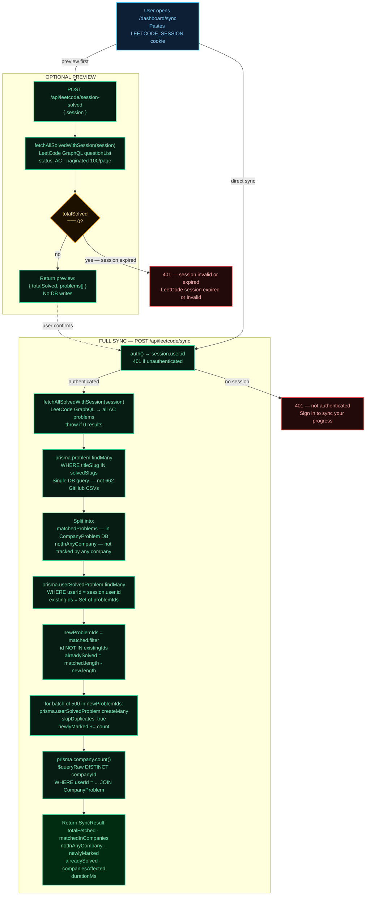
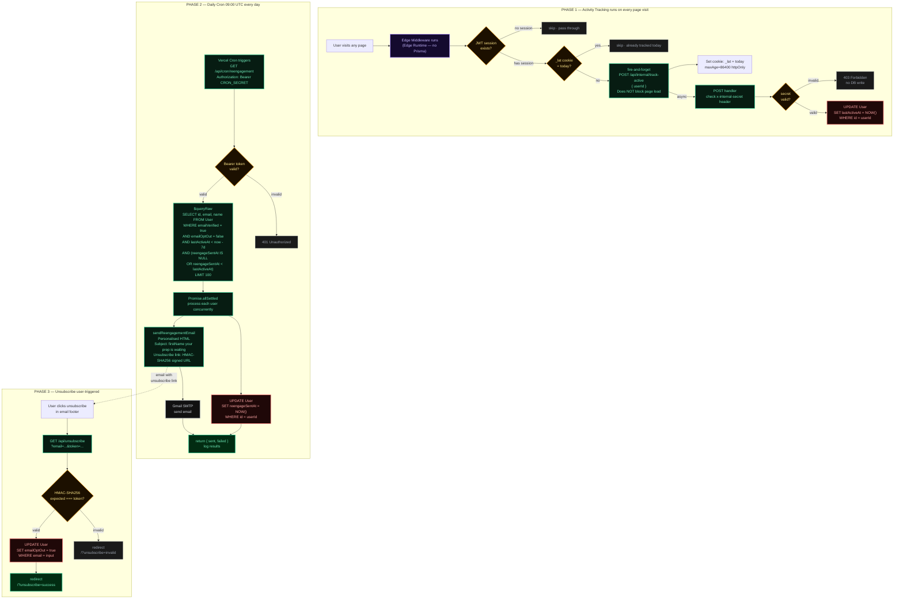
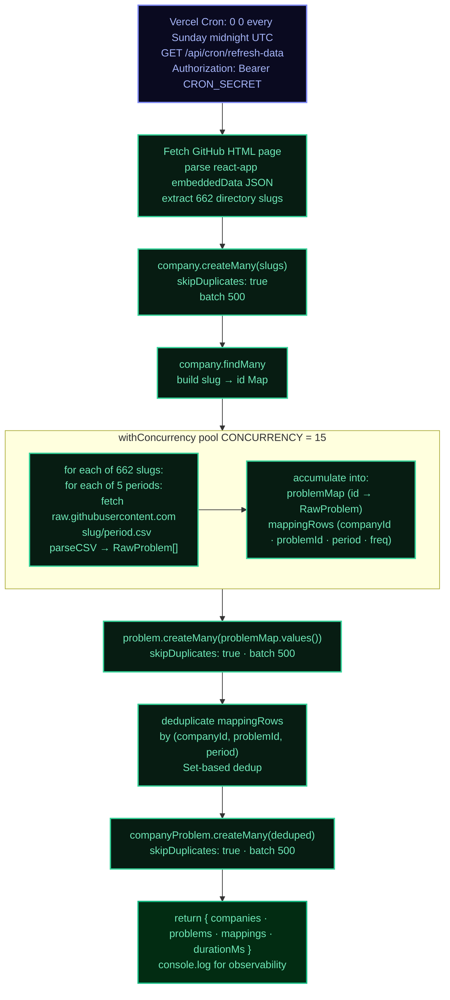
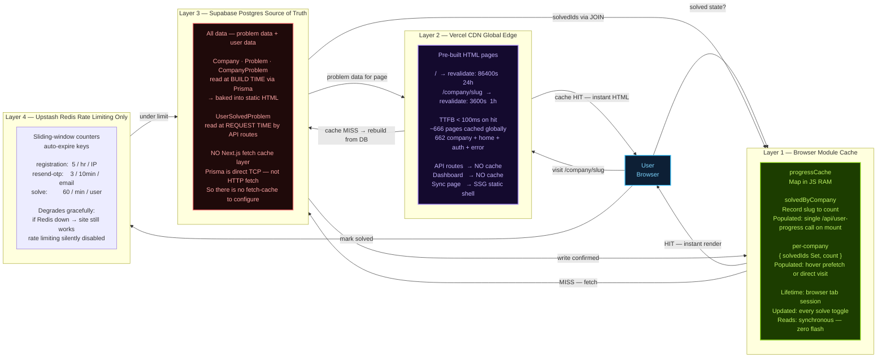
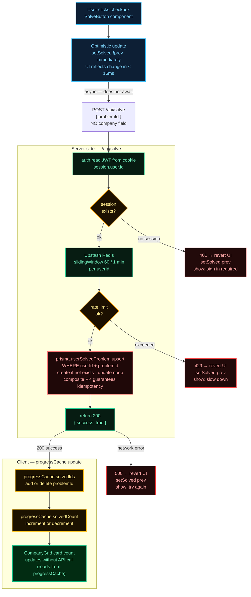
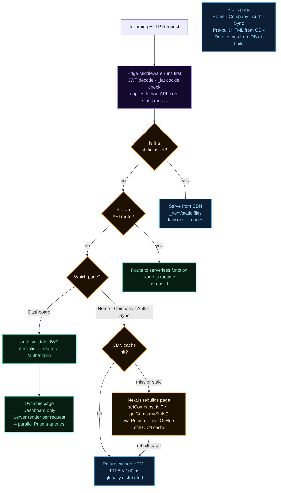
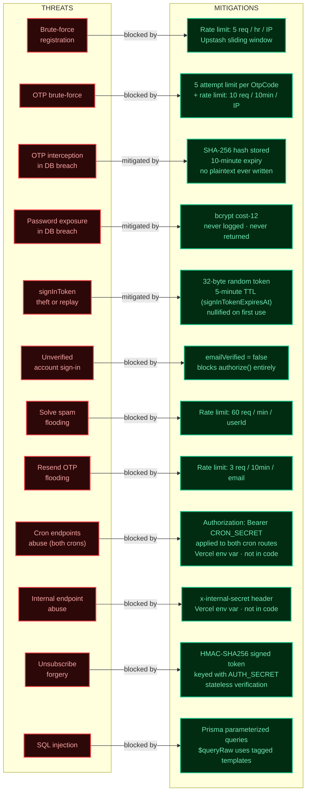

# System Architecture Diagrams — Code Company Wise

## 1 · Master Architecture — The Full Whiteboard

> *This is the one diagram you draw first. Every box is a component, every arrow is a design decision you must be able to defend.*
>
> *Interview question: "Where does GitHub fit?" — Only the weekly refresh cron touches GitHub. Zero runtime page requests go to GitHub.*

```mermaid
flowchart TD
    %% ── Colour palette by layer ──────────────────────────────────────────
    classDef clientCls  fill:#0d1f35,stroke:#38bdf8,stroke-width:2px,color:#7dd3fc
    classDef cacheCls   fill:#1c1200,stroke:#fbbf24,stroke-width:2px,color:#fde68a
    classDef edgeCls    fill:#140a2e,stroke:#a78bfa,stroke-width:2px,color:#c4b5fd
    classDef fnCls      fill:#071c12,stroke:#34d399,stroke-width:2px,color:#6ee7b7
    classDef dbCls      fill:#1f0808,stroke:#f87171,stroke-width:2px,color:#fca5a5
    classDef extCls     fill:#111111,stroke:#9ca3af,stroke-width:2px,color:#d1d5db
    classDef cronCls    fill:#0a0a20,stroke:#818cf8,stroke-width:2px,color:#a5b4fc

    %% ── CLIENT BROWSER ───────────────────────────────────────────────────
    subgraph BROWSER ["CLIENT BROWSER"]
        direction TB
        HP["Home  SSG\n662 company cards\n24h CDN cache"]
        CP["Company  ISR\n662 pages · all 5 periods bundled\n1h revalidation"]
        AP["Auth Pages  SSG\nsignin · signup · verify"]
        DP["Dashboard  Dynamic\nper-user · force-dynamic\n4 parallel DB queries"]
        SP["Sync Page  SSG\n/dashboard/sync\npure client · paste session cookie"]
        CG["CompanyGrid\nfetchAllCompanyProgress on mount\n1 bulk /api/user-progress call"]
        CPC["CompanyProgress\nuseCompanyProgress hook\nProgressBar + ProblemTable"]
        SBN["SolveButton\nmarkSolved(problemId)\nno company param\noptimistic update · revert on failure"]
        PC["progressCache\nmodule-level Map in RAM\nzero-flash across navigations"]
    end

    %% ── VERCEL EDGE ──────────────────────────────────────────────────────
    subgraph VEDGE ["VERCEL EDGE NETWORK"]
        CDN["Global CDN\n~666 pages pre-built\nTTFB < 100ms on cache hit"]
        MW["Edge Middleware\nJWT decode — zero DB calls\n_lat cookie dedup\nfire-and-forget activity ping"]
    end

    %% ── NEXT.JS SERVERLESS ───────────────────────────────────────────────
    subgraph FNLAYER ["SERVERLESS FUNCTIONS  (Node.js · us-east-1)"]
        NA["NextAuth v5\nCredentials Provider\nJWT → httpOnly cookie"]
        REG["POST /api/auth/register\nupsert User  emailVerified=false\nSHA-256 OTP → OtpCode\nGmail OTP email\nrate-limit: 5 / hr / IP"]
        VER["POST /api/auth/verify-otp\ncompare SHA-256 hash\nattempts ≤ 5 guard\nemailVerified = true\nsignInToken 32B · 5min TTL"]
        RES["POST /api/auth/resend-otp\ndelete old OtpCode\nnew OTP + Gmail\nrate-limit: 3 / 10min / email"]
        SOL["POST /api/solve\nauth check\nrate-limit: 60 / min / user\nupsert UserSolvedProblem(userId, problemId)"]
        DSOL["DELETE /api/solve\nauth check\nrate-limit: shared with POST\ndelete UserSolvedProblem"]
        PRG["GET /api/user-progress\n?company=slug — JOIN CompanyProblem\nno param — bulk all companies\nreturns {solvedIds} or {solvedByCompany}"]
        TRK["POST /api/internal/track-active\nx-internal-secret header guard\nlastActiveAt = NOW()"]
        UNS["GET /api/unsubscribe\nHMAC-SHA256 token verify\nemailOptOut = true\nredirect /?unsubscribe=success"]
        CRN["GET /api/cron/reengagement\nBearer CRON_SECRET guard\n$queryRaw inactive >= 7d\nLIMIT 100 / run"]
        REF["GET /api/cron/refresh-data\nBearer CRON_SECRET guard\nfetch GitHub CSVs · 15-concurrency\nupsert Company + Problem + CompanyProblem\nskipDuplicates — safe to re-run"]
        LSS["POST /api/leetcode/session-solved\npreview: LeetCode GraphQL → AC problems\nno DB writes"]
        LSY["POST /api/leetcode/sync\nauth check\nLeetCode GraphQL → AC problems\nJoin against Problem table\nbatch insert UserSolvedProblem\nreturns SyncResult"]
    end

    %% ── VERCEL CRON ──────────────────────────────────────────────────────
    subgraph VCRON ["VERCEL CRON"]
        SCH1["cron: 0 9 * * * UTC\ndaily 09:00 — re-engagement emails"]
        SCH2["cron: 0 0 * * 0 UTC\nweekly Sunday midnight — data refresh"]
    end

    %% ── DATA STORES ──────────────────────────────────────────────────────
    subgraph DSTORE ["DATA STORES"]
        direction LR
        PG["Supabase Postgres\n─────────────────────\nUser\nOtpCode\nCompany\nProblem\nCompanyProblem\nUserSolvedProblem"]
        RD["Upstash Redis\n─────────────────────\nSliding-window\nrate counters · auto-expire"]
    end

    %% ── EXTERNAL SERVICES ────────────────────────────────────────────────
    subgraph EXTSVC ["EXTERNAL SERVICES"]
        direction LR
        GH["GitHub Raw CDN\n662 company CSVs\nWeekly cron only\nNOT in runtime path"]
        GM["Gmail SMTP\nNodemailer transporter\nOTP + re-engagement emails"]
        LC["LeetCode GraphQL API\nquestionList status:AC\nUser-initiated sync only"]
    end

    %% ── CONNECTIONS ──────────────────────────────────────────────────────

    BROWSER    -->|"HTTPS"| CDN
    CDN        -->|"cache HIT — HTML < 100ms"| BROWSER
    CDN        -->|"cache MISS → rebuild from DB"| FNLAYER

    MW         -.->|"fire-and-forget\nnon-blocking POST"| TRK

    SBN        -->|"POST /api/solve { problemId }"| SOL
    SBN        -->|"DELETE /api/solve { problemId }"| DSOL
    CG & CPC   -->|"GET /api/user-progress"| PRG
    AP         -->|"signIn credentials"| NA
    SP         -->|"POST session-solved"| LSS
    SP         -->|"POST sync"| LSY

    PRG        -.->|"populate on first call"| PC
    PC         -.->|"instant read · no API call"| SBN & CPC & CG

    REG        -->|"success → redirect to verify"| VER
    VER        -->|"signIn with signInToken"| NA

    NA         --> PG
    REG        --> PG
    VER        --> PG
    RES        --> PG
    SOL        -->|"upsert UserSolvedProblem"| PG
    DSOL       -->|"delete UserSolvedProblem"| PG
    PRG        -->|"JOIN CompanyProblem"| PG
    TRK        -->|"update lastActiveAt"| PG
    UNS        -->|"emailOptOut = true"| PG
    CRN        -->|"$queryRaw + reengageSentAt"| PG
    REF        -->|"upsert all 4 entity types"| PG
    LSY        -->|"findMany + createMany"| PG

    REG        -->|"rate limit"| RD
    RES        -->|"rate limit"| RD
    SOL & DSOL -->|"rate limit"| RD

    REG & RES  -->|"OTP email"| GM
    CRN        -->|"re-engagement email"| GM

    SCH1       -->|"GET + Bearer token"| CRN
    SCH2       -->|"GET + Bearer token"| REF
    REF        -->|"ONLY connection to GitHub\nweekly · not runtime"| GH

    LSS        -->|"GraphQL AC solved list"| LC
    LSY        -->|"GraphQL AC solved list"| LC

    %% ── Apply colours ────────────────────────────────────────────────────
    class HP,CP,AP,DP,SP,CG,CPC,SBN clientCls
    class PC,RD cacheCls
    class CDN,MW edgeCls
    class NA,REG,VER,RES,SOL,DSOL,PRG,TRK,UNS,CRN,REF,LSS,LSY fnCls
    class PG dbCls
    class GH,GM,LC extCls
    class SCH1,SCH2 cronCls
```



---

## 2 · Authentication Flow (Deep Dive)

> *Two paths share one NextAuth Credentials provider. Interview question: "Why not OAuth?" — this system needs email ownership proof for a free tool with no social login requirement.*

```mermaid
flowchart TD
    classDef clientCls  fill:#0d1f35,stroke:#38bdf8,stroke-width:2px,color:#7dd3fc
    classDef fnCls      fill:#071c12,stroke:#34d399,stroke-width:2px,color:#6ee7b7
    classDef dbCls      fill:#1f0808,stroke:#f87171,stroke-width:2px,color:#fca5a5
    classDef extCls     fill:#111111,stroke:#9ca3af,stroke-width:2px,color:#d1d5db
    classDef decCls     fill:#1c1000,stroke:#f59e0b,stroke-width:2px,color:#fde68a
    classDef okCls      fill:#022c12,stroke:#10b981,stroke-width:2px,color:#6ee7b7
    classDef failCls    fill:#220a0a,stroke:#ef4444,stroke-width:2px,color:#fca5a5

    %% ── PATH A: REGISTRATION ─────────────────────────────────────────────
    subgraph PATHA ["PATH A — New User Registration"]
        A1["User submits SignUp form\nemail · password · name"]
        A2["POST /api/auth/register\nnormalize email lowercase+trim"]
        A3{"IP rate limit\n5 req / hr ?"}
        A4["upsert User\nemailVerified = false\nbcrypt hash password cost 12"]
        A5["deleteMany old OtpCodes\ncreate OtpCode\ncodeHash = SHA-256 code\nexpiresAt = now + 10 min\nattempts = 0"]
        A6["Gmail SMTP\nsend 6-digit OTP email"]
        A7["Redirect → /auth/verify\nURL: ?email=..."]
        A8["User reads email\nenters OTP in form"]
        A9["POST /api/auth/verify-otp\nfind OtpCode WHERE email=..."]
        A10{"OTP expired?\nattempts > 5?"}
        A11{"SHA-256 input\n=== codeHash ?"}
        A12["DELETE OtpCode record\nUser.emailVerified = true\nUser.signInToken = randomBytes 32\nUser.signInTokenExpiresAt = +5 min"]
        A13["Client calls signIn\ncredentials\n{ email, signInToken }"]
    end

    %% ── PATH B: SIGN IN ──────────────────────────────────────────────────
    subgraph PATHB ["PATH B — Returning User Sign In"]
        B1["User submits SignIn form\nemail · password"]
        B2["Client calls signIn\ncredentials\n{ email, password }"]
    end

    %% ── NEXTAUTH AUTHORIZE ───────────────────────────────────────────────
    subgraph AUTHZ ["NextAuth authorize  shared by both paths"]
        C1["prisma.user.findUnique\nWHERE email = input"]
        C2{"user exists?\nemailVerified = true?"}
        C3{"password path:\nbcrypt.compare hash\n\ntoken path:\nsignInToken match?\nnot expired? (signInTokenExpiresAt)"}
        C4["consume signInToken\nset null in DB\none-time use enforced"]
        C5["return { id, email, name }\n→ NextAuth builds JWT payload"]
        C6["JWT signed with AUTH_SECRET\nstored in httpOnly cookie\nsession active"]
    end

    %% ── ERROR STATES ─────────────────────────────────────────────────────
    E1["429 Too Many Requests"]
    E2["400 OTP Expired\nor Max Attempts Reached"]
    E3["401 Invalid OTP"]
    E4["401 Unauthorized\nno user · unverified · bad creds"]

    %% ── FLOW ─────────────────────────────────────────────────────────────
    A1 --> A2 --> A3
    A3 -->|"exceeded"| E1
    A3 -->|"ok"| A4
    A4 --> A5 --> A6 --> A7 --> A8 --> A9 --> A10
    A10 -->|"yes"| E2
    A10 -->|"no"| A11
    A11 -->|"no match"| E3
    A11 -->|"match"| A12 --> A13 --> C1

    B1 --> B2 --> C1

    C1 --> C2
    C2 -->|"no"| E4
    C2 -->|"yes"| C3
    C3 -->|"fail"| E4
    C3 -->|"signInToken path"| C4 --> C5
    C3 -->|"password path"| C5
    C5 --> C6

    class A1,A7,A8,B1 clientCls
    class A2,A4,A5,A6,A9,A12,A13,B2,C1,C4,C5 fnCls
    class C2,C3,A3,A10,A11 decCls
    class C6 okCls
    class E1,E2,E3,E4 failCls
```



---

## 3 · LeetCode Sync Flow (New Subsystem)

> *Interview question: "How do you avoid inserting duplicates during sync?" — three layers: in-code diff against existing rows, skipDuplicates on createMany, and the composite PK constraint at the DB level.*



---

## 4 · Re-engagement Email Pipeline

> *Interview question: "How do you avoid hammering users with emails?" — three guards: emailOptOut flag, reengageSentAt < lastActiveAt condition, and LIMIT 100 per cron run.*



---

## 5 · Data Refresh Pipeline — Weekly Cron

> *Interview question: "What happens if GitHub is down?" — the cron skips that week's run. All existing data stays in Postgres untouched. The site is completely unaffected because no runtime page requests go to GitHub.*



---

## 6 · Caching Strategy — 3 Layers

> *Interview question: "What happens if Postgres is down?" — API routes return 500. But static pages (662 company pages + home page) are already built and cached on Vercel's CDN globally — they continue serving to users. Only solve tracking breaks.*



---

## 7 · Database Schema (Entity-Relationship)

> *Interview question: "Why is there no company column in UserSolvedProblem?" — in v1, solving 'Two Sum' for Amazon and Google were separate rows. That caused duplication and made sync hard. Now solve is global; company coverage is queried via JOIN through CompanyProblem at read time.*

```mermaid
erDiagram
    User {
        String   id                    PK   "cuid()"
        String   email                 UK   "unique, nullable"
        String   name                       "nullable display name"
        String   password                   "bcrypt cost-12, nullable"
        Boolean  emailVerified              "default false — auth gate"
        DateTime createdAt                  "default now()"
        DateTime lastActiveAt          IDX  "default now() — INDEX for cron"
        DateTime reengageSentAt             "nullable — compared vs lastActiveAt"
        Boolean  emailOptOut                "default false — GDPR exit"
        String   signInToken                "nullable — 32-byte single-use"
        DateTime signInTokenExpiresAt       "nullable — 5-minute TTL"
    }

    OtpCode {
        String   id         PK   "cuid()"
        String   email      IDX  "not FK — lookup by email string"
        String   codeHash        "SHA-256 hex — plaintext never stored"
        Int      attempts        "default 0 — max 5 guard"
        DateTime expiresAt       "now + 10 minutes"
        DateTime createdAt       "default now()"
    }

    Company {
        Int    id    PK   "autoincrement"
        String slug  UK   "google"
        String name       "Google"
    }

    Problem {
        Int    id             PK   "LeetCode frontendQuestionId — NOT autoincrement"
        String titleSlug      UK   "two-sum — IDX for sync lookup"
        String title               "Two Sum"
        String difficulty          "Easy or Medium or Hard"
        Float  acceptanceRate      "49.1"
    }

    CompanyProblem {
        Int    companyId  PK,FK  "composite PK with problemId and period"
        Int    problemId  PK,FK  "composite PK"
        String period     PK     "thirty-days or three-months or six-months or more-than-six-months or all"
        Float  frequency         "relative frequency 0-100"
    }

    UserSolvedProblem {
        String   userId    PK,FK  "composite PK with problemId — cascade delete"
        Int      problemId PK,FK  "composite PK — NO company column"
        DateTime solvedAt         "default now() — IDX with userId for recent activity"
    }

    User            ||--o{ UserSolvedProblem : "has solved"
    Problem         ||--o{ UserSolvedProblem : "solved by"
    Company         ||--o{ CompanyProblem    : "has problems"
    Problem         ||--o{ CompanyProblem    : "appears at companies"
```

**Index summary:**

| Table | Index | Type | Purpose |
|---|---|---|---|
| User | `email` | UNIQUE | fast lookup on sign-in |
| User | `lastActiveAt` | B-Tree | cron query: `WHERE lastActiveAt < 7d` |
| OtpCode | `email` | B-Tree | find OTP during verify flow |
| Problem | `titleSlug` | UNIQUE | LeetCode Sync: `WHERE titleSlug IN (...)` |
| Problem | `difficulty` | B-Tree | filter queries by difficulty |
| CompanyProblem | `(companyId, period, frequency)` | B-Tree | `getCompanyProblems()` — ORDER BY frequency |
| CompanyProblem | `problemId` | B-Tree | dashboard: JOIN from UserSolvedProblem |
| UserSolvedProblem | `(userId, problemId)` | UNIQUE PK | upsert idempotency, fast lookup |
| UserSolvedProblem | `(userId, solvedAt)` | B-Tree | recent activity query ORDER BY solvedAt |

---

## 8 · Solve a Problem — End-to-End Flow

> *Interview question: "Why optimistic update?" — 60ms network latency per click feels sluggish at 100 rapid marks. Optimistic UI removes perceived lag; revert on failure keeps correctness.*



---

## 9 · Request Lifecycle Decision Tree

> *Interview question: "How do you decide what to SSG vs SSR vs dynamic?" — if the page content depends on who's viewing it, it must be dynamic. Everything else should be static.*



---

## 10 · Security Threat Model

> *Interview question: "Walk me through your auth security." — five layers: rate limiting, OTP hashing, bcrypt, single-use tokens, and emailVerified gate. No single failure compromises the account.*



---

## Interview Discussion Map

| Diagram | Interview Time | Key Questions It Answers |
|---|---|---|
| **1 · Master Architecture** | 0–20 min | What are all the components? Why this tech stack? Where does GitHub fit at runtime? |
| **7 · DB Schema** | 20–35 min | Why 4 tables now? Why no company column in UserSolvedProblem? What are the indexes? |
| **2 · Auth Flow** | 35–55 min | How does OTP work? Why SHA-256 not bcrypt for OTP? What is signInToken? |
| **6 · Caching** | 55–70 min | How do you get TTFB < 100ms? What happens when Postgres is down? No GitHub at runtime? |
| **4 · Re-engagement** | 70–80 min | How does lastActiveAt get updated? Why fire-and-forget? How do you avoid email spam? |
| **5 · Data Refresh** | 80–90 min | How is problem data kept fresh? Why skipDuplicates? What if GitHub is down during cron? |
| **3 · LeetCode Sync** | 90–100 min | How does sync avoid duplicates (three layers)? Why is sync a single DB query not 662 fetches? |
| **8 · Solve Flow** | 100–110 min | Why optimistic update? How do you keep the cache consistent? Why no company in POST /api/solve? |
| **9 · Request Lifecycle** | 110–115 min | How does Next.js decide static vs dynamic? Why is the layout static? |
| **10 · Security** | 115–120 min | Walk through each threat vector and mitigation |
